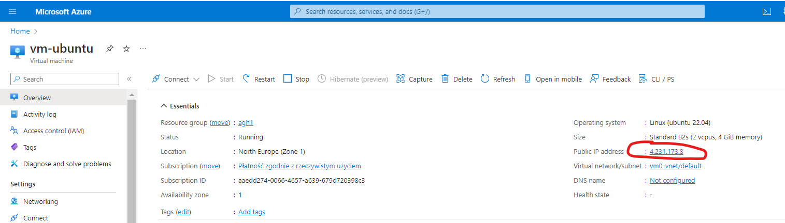
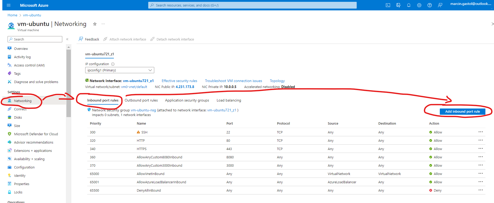
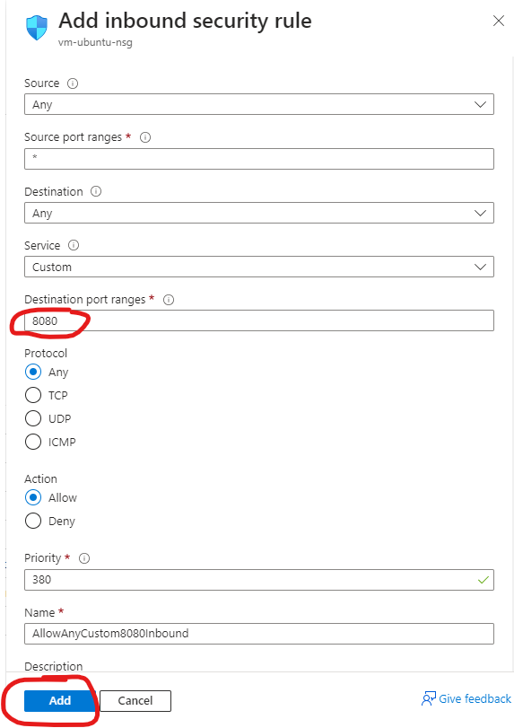

# Exercise: Managing a Simple Web Server Container

## Introduction

In this exercise, you will learn how to set up and manage a simple web server using Docker. This will include pulling an Nginx image from Docker Hub, running it as a container, managing and interacting with the container, and concluding with the removal of the container and the image.

---

## Task Overview

1. Pulling the Nginx Image from Docker Hub.
2. Running the Nginx Image as a Container.
3. Listing Running Containers.
4. Accessing the Nginx Server Through a Web Browser.
5. Executing a Command Inside the Running Container.
6. Viewing Logs of the Container.
7. Stopping, Starting, and Removing the Container.
8. Removing the Docker Image.

---

## Pull the Nginx Image

### Overview

Pulling an image is the first step in containerization. You will pull the Nginx image from Docker Hub, which is a public Docker image registry.

1. Pull the Nginx Image:
   ```bash
   sudo docker pull nginx
   ```

   _This command downloads the latest Nginx image from Docker Hub._

---

## Run the Nginx Container

### Overview

Running a container is the next step after pulling an image. This step involves setting up the Docker image to run as a service, like a web server.

1. Run the Nginx Container:
   ```bash
   sudo docker run --name my-nginx -d -p 8080:80 nginx
   ```
   _The `docker run` command creates and starts a new container. `--name my-nginx` assigns the name `my-nginx` to the container. `-d` runs the container in detached mode. `-p 8080:80` maps port 8080 on the host to port 80 in the container._

---

## List Running Containers

### Overview

Listing running containers allows you to see which containers are active on your system.

1. List Running Containers:
   ```bash
   sudo docker ps
   ```
   _This command lists all currently running Docker containers._

---

## Access the Web Server

### Overview

Accessing the web server is essential to verify if the container is running correctly.

1. Go to Azure Portal, open Virtual Machine. In properties get Public IP address and paste it in seperate tab.




2. Time to open port 8080. Go to Navigation, inbound port rules and Add inbound port rule



3. Add port 8080, ensure all other data is the same as in the screenshot, and click Add button.



4. Access the Web Server:
   Edit address to `http://...public-ip-address...:8080` so with port 8080, where Nginx server is running.
   _This step verifies that the Nginx server is running and accessible._

---

## Execute Command Inside Container

### Overview

Executing a command inside the container is useful for debugging and managing the container's internal state.

1. Execute Command Inside Container:
   ```bash
   sudo docker exec my-nginx cat /usr/share/nginx/html/index.html
   ```
   _This command runs `cat` inside the `my-nginx` container to display the contents of the Nginx index.html file._

---

## View Container Logs

### Overview

Viewing logs is crucial for troubleshooting and understanding the behavior of your container.

1. View Container Logs:
   ```bash
   sudo docker logs my-nginx
   ```
   _This command displays the logs generated by the `my-nginx` container._

---

## Stop, Start, and Remove Container

### Overview

Properly managing the lifecycle of your container includes stopping, starting, and eventually removing it.

1. Stop the Container:
   ```bash
   sudo docker stop my-nginx
   ```
   _Stops the `my-nginx` container._

2. Start the Container:
   ```bash
   sudo docker start my-nginx
   ```
   _Starts the `my-nginx` container if it was previously stopped._

3. Remove the Container:
   ```bash
   sudo docker rm my-nginx
   ```
   _Removes the `my-nginx` container from your system._

---

## Remove the Docker Image

### Overview

Removing unused Docker images helps to keep your system clean.

1. Remove the Docker Image:
   ```bash
   sudo docker rmi nginx
   ```
   _This command removes the `nginx` image from your system._

---
