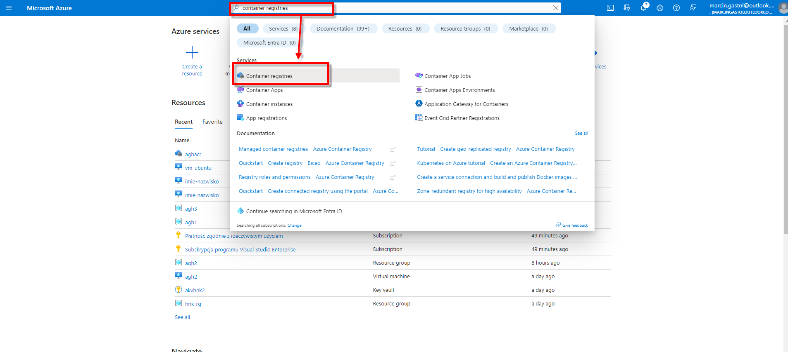
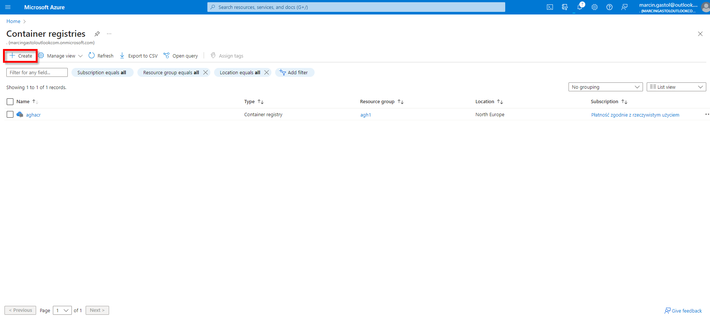
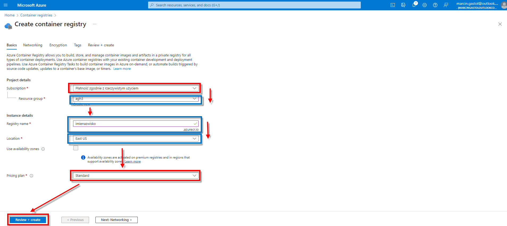
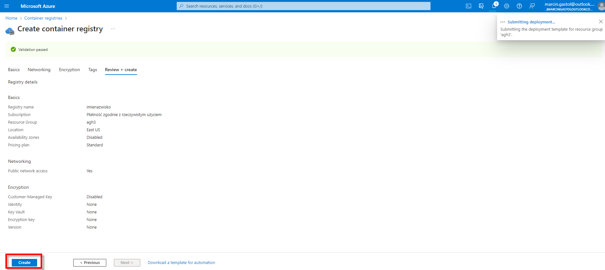

# Environment Setup with Azure CLI and Docker

## Introduction

This guide outlines the steps to set up Azure CLI and Docker for managing and pushing Docker images to Azure Container Registry (ACR).

## Part 0: Creating Azure Container Registry (ACR)









## Part 1: Installing Azure CLI

### Overview

Azure CLI is a set of commands used to manage Azure resources. It is essential for interacting with Azure services from the command line.

### Steps

1. **Install Azure CLI**:
   ```bash
   curl -sL https://aka.ms/InstallAzureCLIDeb | sudo bash
   ```
   _This command downloads and installs the Azure CLI using a script provided by Microsoft. `curl` fetches the script, and `bash` executes it._

---

## Part 2: Logging into Azure Container Registry

### Overview

Log into Azure Container Registry (ACR) to manage and push Docker images.

### Steps

1. **Verify Azure CLI Installation**:
   ```bash
   az
   ```
   _Runs the Azure CLI command to ensure it's properly installed._

2. **Authenticate with Azure Container Registry**:
   ```bash
   TOKEN=$(az acr login --name aghacr --expose-token --output tsv --query accessToken)
   ```
   **Change _aghacr_ to your registry name!**
   
   _Logs into Azure Container Registry (ACR) and retrieves an access token. `--name aghacr` specifies the name of your ACR. The token is saved in the `TOKEN` variable._

3. **Docker Login using Azure Token**:
   ```bash
   sudo docker login aghacr.azurecr.io --username 00000000-0000-0000-0000-000000000000 --password-stdin <<< $TOKEN
   ```
   **Change _aghacr_ to your registry name!**

   _Logs into Docker with the Azure registry. `--username` is a placeholder for Azure service principal, and the password is provided via stdin from the `TOKEN` variable._

4. **Show ACR Login Server**:
   ```bash
   az acr show --name aghacr --query loginServer --output table
   ```
   **Change _aghacr_ to your registry name!**

   _Displays the login server for the specified Azure Container Registry._

---

## Part 3: Tagging and Pushing Docker Images to ACR

### Overview

Tag a local Docker image and push it to Azure Container Registry.

### Steps

1. **List Local Docker Images**:
   ```bash
   sudo docker images
   ```
   _Lists all Docker images available on your local machine._

2. **Tag the Docker Image for ACR**:
   ```bash
   sudo docker tag getting-started aghacr.azurecr.io/getting-started:v1
   ```
   **Change _aghacr_ to your registry name!**


   _Tags the local `getting-started` Docker image for Azure Container Registry. `v1` is the tag/version of the image._

3. **Verify the Tagged Docker Image**:
   ```bash
   sudo docker images
   ```
   _Lists Docker images to verify the newly tagged image._

4. **Push the Docker Image to ACR**:
   ```bash
   sudo docker push aghacr.azurecr.io/getting-started:v1
   ```

   **Change _aghacr_ to your registry name!**

   _Pushes the tagged Docker image to the specified Azure Container Registry._

---